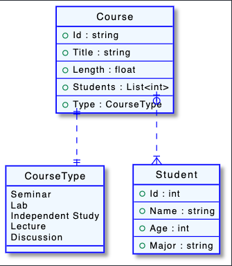
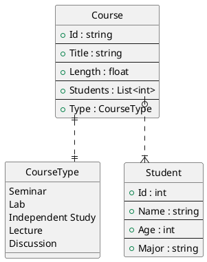

# Xamarin Courses App

### Diagram Version 1:

```plantuml
  skinparam class {
    BackgroundColor aliceblue
    ArrowColor blue
    BorderColor blue
  }

  @startuml
    hide circle
    skinparam linetype ortho

    entity "Course" as c {
      +Id : string
      --
      +Title : string
      --
      +Length : float
      --
      +Students : List<int>
      --
      +Type : CourseType
    }

    entity "CourseType" as ct {
      Seminar
      Lab
      Independent Study
      Lecture
      Discussion
    }

    entity "Student" as s {
      +Id : int
      --
      +Name : string
      --
      +Age : int
      --
      +Major : string
    }

    c::CourseType ||..|| ct
    c::Students |o..|{ s
  @enduml
```

### Resources:
[Pull-to-refresh with Xamarin.Forms RefreshView](https://devblogs.microsoft.com/xamarin/refreshview-xamarin-forms/)
