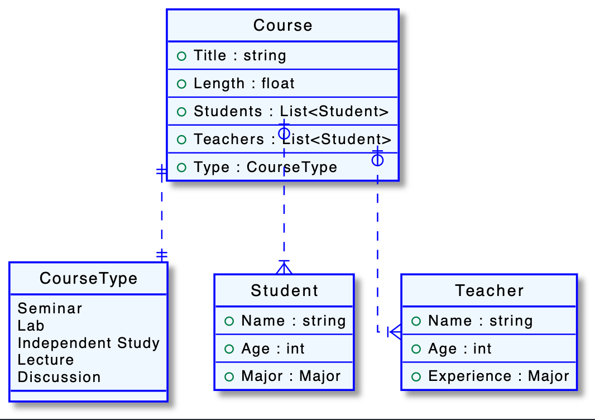
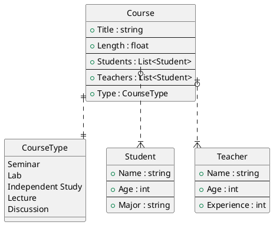

# xamarin-courses-app-v1

### Diagram Version 1:

```plantuml
  skinparam class {
  BackgroundColor aliceblue
  ArrowColor blue
  BorderColor blue
  }

  @startuml

  hide circle
  skinparam linetype ortho

  entity "Course" as c {
    +Title : string
    --
    +Length : float
    --
    +Students : List<Student>
    --
    +Teachers : List<Student>
    --
    +Type : CourseType
  }

  entity "CourseType" as ct {
    Seminar
    Lab
    Independent Study
    Lecture
    Discussion
  }

  entity "Student" as s {
    +Name : string
    --
    +Age : int
    --
    +Major : string
  }

  entity "Teacher" as t {
    +Name : string
    --
    +Age : int
    --
    +Experience : int
  }

  c::CourseType ||..|| ct
  c::Students |o..|{ s
  c::Teachers |o..|{ t
  @enduml
```